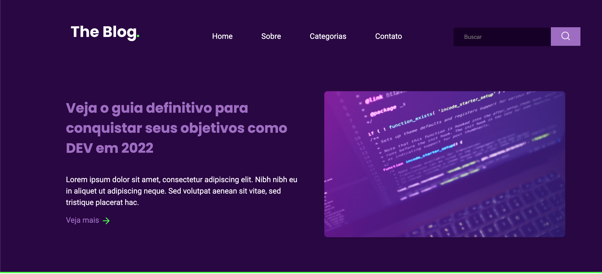

<h1 align="center"> Desafio RocketBlog 💻	 </h1>

Desafio proposto pelo site da Rocketseat pra desenvolver uma homepage para um blog.

 

  

## 🚀 Tecnologias

Esse projeto foi desenvolvido com as seguintes tecnologias:

- HTML e CSS
- Git e Github

---

Feito com ♥ by Yasmin :wave: